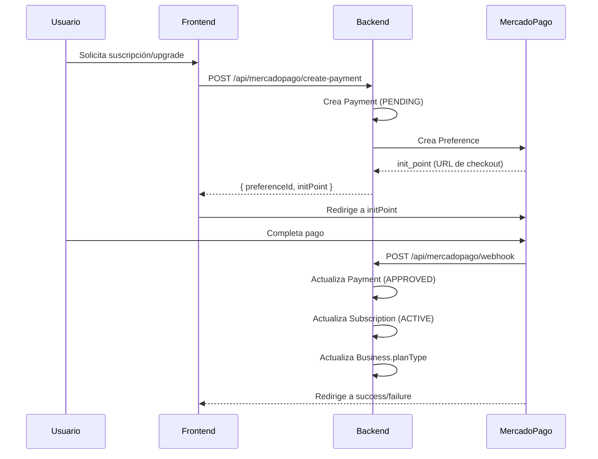
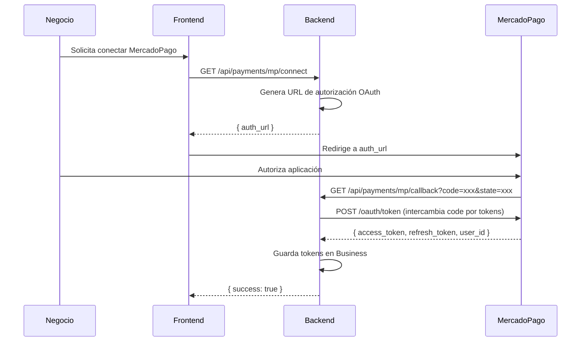
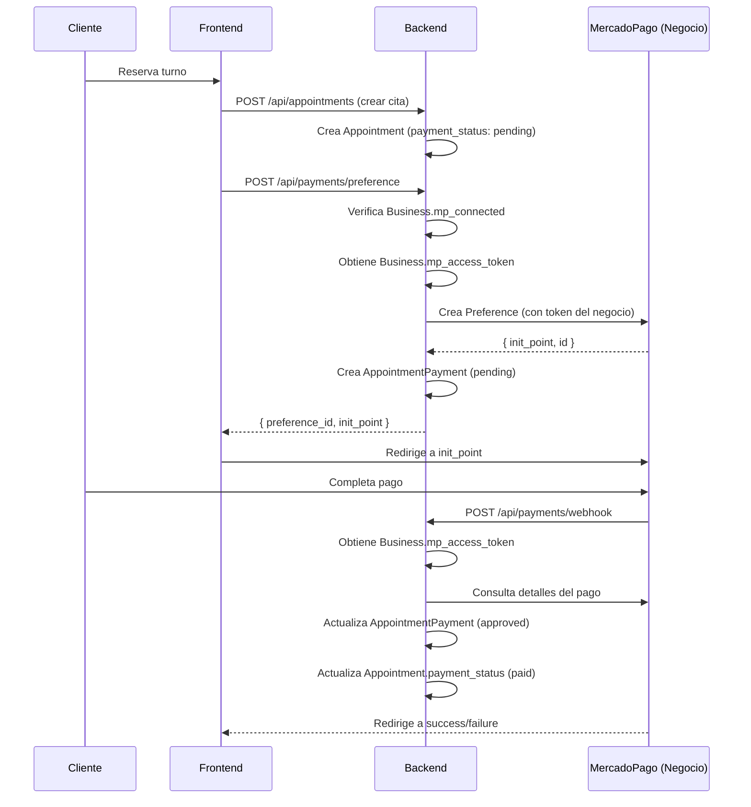

# 🔍 Revisión Completa del Sistema de Pagos - TurnIO

**Fecha:** 2024-12-19  
**Objetivo:** Revisar y documentar ambos sistemas de pago de la aplicación

---

## 📋 Resumen Ejecutivo

La aplicación tiene **DOS sistemas de pago independientes**:

1. **💰 Sistema de Suscripciones** - Los negocios pagan a la plataforma por usar la herramienta
   - Usa el MercadoPago del **dueño de la plataforma**
   - Token: `MERCADOPAGO_ACCESS_TOKEN` (variable de entorno)
   - Archivos: `mercadoPagoController.js`, `subscriptionAutoController.js`

2. **💳 Sistema de Pagos por Turnos** - Los clientes pagan a cada negocio por sus citas
   - Cada negocio conecta su **propio MercadoPago** mediante OAuth
   - Tokens: Guardados en `Business.mp_access_token` (por negocio)
   - Archivos: `paymentController.js`, `mercadoPagoService.js`

---

## 1️⃣ SISTEMA DE SUSCRIPCIONES (Pago a la Plataforma)

### 📁 Archivos Principales

- **Controlador:** `backend/src/controllers/mercadoPagoController.js`
- **Controlador Alternativo:** `backend/src/controllers/subscriptionAutoController.js`
- **Rutas:** `backend/src/routes/mercadoPagoRoutes.js`
- **Modelos:** `Subscription`, `Payment` (en `schema.prisma`)

### 🔑 Configuración

**Variables de Entorno Requeridas:**
```env
MERCADOPAGO_ACCESS_TOKEN=APP-xxxxx  # Token del dueño de la plataforma
MERCADOPAGO_PUBLIC_KEY=APP-xxxxx    # Public key del dueño de la plataforma
BACKEND_URL=https://turnio-backend-production.up.railway.app
FRONTEND_URL=https://turnio-frontend-production.up.railway.app
```

**Cliente MercadoPago:**
```javascript
// backend/src/controllers/mercadoPagoController.js:7
const mpClient = new MercadoPagoConfig({ 
  accessToken: process.env.MERCADOPAGO_ACCESS_TOKEN 
});
```

### 🔄 Flujo de Pago de Suscripción

#### Método 1: Pago Único (Preference) - **ACTUALMENTE EN USO**



**Endpoints:**
- `POST /api/mercadopago/create-payment` - Crear preferencia de pago
- `POST /api/mercadopago/webhook` - Webhook de notificaciones
- `GET /api/mercadopago/payment-status/:paymentId` - Verificar estado

**Código Clave:**
```238:416:backend/src/controllers/mercadoPagoController.js
// Crear preferencia de pago para suscripción (método original)
const createSubscriptionPayment = async (req, res) => {
  // ... código de creación de preferencia
  const prefClient = new Preference(mpClient);
  const response = await prefClient.create({ body: preference });
  // ...
};
```

#### Método 2: Suscripción Automática (Subscription) - **NO FUNCIONA COMPLETAMENTE**

```javascript
// backend/src/controllers/mercadoPagoController.js:10
const createAutomaticSubscription = async (req, res) => {
  // Usa API de Subscription (PreApproval)
  const subClient = new Subscription(mpClient);
  const response = await subClient.create({ body: subscriptionData });
};
```

**Problemas Identificados:**
- ❌ Requiere permisos especiales de MercadoPago
- ❌ No funciona con tokens de prueba (TEST-)
- ❌ Requiere cuenta verificada
- ❌ El usuario debe autorizar débito automático

**Webhook:** `POST /api/mercadopago/subscription-webhook`

### 📊 Modelos de Datos

**Subscription:**
```prisma
model Subscription {
  id                        String              @id
  businessId                String              @unique
  planType                  PlanType            // FREE, BASIC, PREMIUM, ENTERPRISE
  status                    SubscriptionStatus  // ACTIVE, CANCELLED, SUSPENDED
  billingCycle              BillingCycle        // MONTHLY, YEARLY
  priceAmount               Float
  mercadoPagoSubscriptionId String?            // ID de suscripción en MP
  metadata                  Json?               // Info adicional (upgrades pendientes)
}
```

**Payment (Suscripciones):**
```prisma
model Payment {
  id                    String        @id
  subscriptionId        String
  amount                Float
  status                PaymentStatus // PENDING, APPROVED, REJECTED
  mercadoPagoPaymentId  String?
  preferenceId          String?
  paidAt                DateTime?
}
```

### ⚠️ Problemas Identificados

1. **Dos métodos diferentes** para crear pagos (confusión)
2. **Suscripciones automáticas no funcionan** en producción
3. **Webhook no procesa upgrades correctamente** (ya corregido en código)
4. **Falta validación de firma** en webhooks (seguridad)
5. **No hay sistema de recordatorios** para renovaciones

---

## 2️⃣ SISTEMA DE PAGOS POR TURNOS (Pago a Negocios)

### 📁 Archivos Principales

- **Controlador:** `backend/src/controllers/paymentController.js`
- **Servicio:** `backend/src/services/mercadoPagoService.js`
- **Rutas:** `backend/src/routes/paymentRoutes.js`
- **Modelos:** `AppointmentPayment`, `PaymentSettings` (en `schema.prisma`)

### 🔑 Configuración

**Variables de Entorno Requeridas:**
```env
MP_CLIENT_ID=6037903379451498              # ID de aplicación OAuth
MP_CLIENT_SECRET=xxxxx                     # Secret de aplicación OAuth
MP_REDIRECT_URI=https://turnio-frontend-production.up.railway.app/dashboard/settings/payments/callback
BACKEND_URL=https://turnio-backend-production.up.railway.app
FRONTEND_URL=https://turnio-frontend-production.up.railway.app
```

**Credenciales por Negocio:**
```prisma
model Business {
  mp_access_token  String?    // Token de acceso del negocio
  mp_refresh_token String?    // Token de refresco
  mp_user_id       String?    // ID de usuario en MP
  mp_public_key    String?    // Public key del negocio
  mp_connected     Boolean    @default(false)
  mp_connected_at  DateTime?
}
```

### 🔄 Flujo de Conexión OAuth



**Endpoints:**
- `GET /api/payments/mp/connect` - Obtener URL de autorización
- `GET /api/payments/mp/callback` - Callback OAuth (público)
- `POST /api/payments/mp/callback` - Callback OAuth (alternativo)
- `GET /api/payments/mp/status` - Verificar estado de conexión
- `DELETE /api/payments/mp/disconnect` - Desconectar cuenta

**Código Clave:**
```18:30:backend/src/services/mercadoPagoService.js
generateAuthUrl(businessId, state = null) {
  const stateParam = state || `business_${businessId}_${Date.now()}`;
  
  const params = new URLSearchParams({
    client_id: this.clientId,
    response_type: 'code',
    state: stateParam,
    redirect_uri: this.redirectUri
  });

  return `https://auth.mercadopago.com.ar/authorization?${params.toString()}`;
}
```

### 🔄 Flujo de Pago por Turno



**Endpoints:**
- `POST /api/payments/preference` - Crear preferencia de pago para cita
- `POST /api/payments/webhook` - Webhook de notificaciones
- `GET /api/payments/status/:appointmentId` - Verificar estado de pago
- `GET /api/payments/history` - Historial de pagos del negocio

**Código Clave:**
```135:247:backend/src/services/mercadoPagoService.js
async createPaymentPreference(appointmentId, businessId) {
  // Obtener cliente de MP para el negocio
  const { client, business } = await this.getMPClientForBusiness(businessId);
  const preference = new Preference(client);
  
  // Crear preferencia con token del negocio
  const result = await preference.create({ body: preferenceData });
  
  // Guardar registro de pago
  const payment = await prisma.appointmentPayment.create({...});
  
  return { preference_id, init_point, ... };
}
```

### 📊 Modelos de Datos

**AppointmentPayment:**
```prisma
model AppointmentPayment {
  id              String   @id
  business_id     String
  appointment_id  String   @unique
  mp_payment_id   String?  // ID del pago en MP
  mp_preference_id String? // ID de la preferencia
  amount          Float
  status          String   // pending, approved, rejected
  payment_method  String?  // credit_card, debit_card, etc
  paid_at         DateTime?
  mp_data         Json?    // Respuesta completa de MP
}
```

**PaymentSettings:**
```prisma
model PaymentSettings {
  id                    String   @id
  business_id           String   @unique
  require_payment        Boolean  @default(false)
  payment_deadline_hours Int      @default(24)
  auto_cancel_unpaid     Boolean  @default(false)
}
```

### ⚠️ Problemas Identificados

1. **No hay refresh de tokens** - Los tokens OAuth pueden expirar
2. **No hay validación de firma** en webhooks
3. **No hay manejo de errores** cuando el negocio desconecta MP
4. **Falta validación** de que el negocio tenga MP conectado antes de crear citas

---

## 3️⃣ COMPARACIÓN DE AMBOS SISTEMAS

| Aspecto | Suscripciones (Plataforma) | Pagos por Turnos (Negocios) |
|---------|---------------------------|----------------------------|
| **Token MercadoPago** | `MERCADOPAGO_ACCESS_TOKEN` (env) | `Business.mp_access_token` (BD) |
| **Cliente** | Único para toda la plataforma | Uno por negocio |
| **OAuth** | ❌ No requiere | ✅ Requiere (cada negocio) |
| **Webhook** | `/api/mercadopago/webhook` | `/api/payments/webhook` |
| **Modelo de Pago** | `Payment` (suscripciones) | `AppointmentPayment` (citas) |
| **Propósito** | Negocios → Plataforma | Clientes → Negocios |
| **Estado Actual** | ⚠️ Funcional pero mejorable | ✅ Funcional |

---

## 4️⃣ PROBLEMAS CRÍTICOS IDENTIFICADOS

### 🔴 Críticos

1. **Falta validación de firma en webhooks**
   - **Riesgo:** Webhooks falsos pueden modificar pagos
   - **Solución:** Implementar validación de firma de MercadoPago

2. **Tokens OAuth pueden expirar sin refresh**
   - **Riesgo:** Pagos por turnos dejan de funcionar
   - **Solución:** Implementar refresh automático de tokens

3. **No hay manejo de errores cuando MP está desconectado**
   - **Riesgo:** Errores 500 al crear preferencias
   - **Solución:** Validar conexión antes de crear preferencias

### 🟡 Importantes

4. **Dos métodos de suscripción (confusión)**
   - **Problema:** `createSubscriptionPayment` vs `createAutomaticSubscription`
   - **Solución:** Unificar o documentar cuándo usar cada uno

5. **No hay sistema de recordatorios de renovación**
   - **Problema:** Suscripciones expiran sin aviso
   - **Solución:** Implementar emails de recordatorio

6. **Webhook de suscripciones no procesa upgrades correctamente**
   - **Estado:** Ya corregido en código (líneas 475-489 de `mercadoPagoController.js`)
   - **Verificar:** Que esté funcionando en producción

### 🟢 Mejoras Sugeridas

7. **Logs estructurados** para debugging
8. **Retry logic** para webhooks fallidos
9. **Idempotencia** en webhooks (evitar procesar 2 veces)
10. **Monitoreo** de pagos pendientes

---

## 5️⃣ RECOMENDACIONES

### ✅ Inmediatas (Esta Semana)

1. **Implementar validación de firma en webhooks**
   ```javascript
   // Verificar firma de MercadoPago
   const xSignature = req.headers['x-signature'];
   const isValid = verifySignature(req.body, xSignature);
   if (!isValid) return res.status(401).json({ error: 'Invalid signature' });
   ```

2. **Implementar refresh de tokens OAuth**
   ```javascript
   // En mercadoPagoService.js
   async refreshAccessToken(businessId) {
     const business = await prisma.business.findUnique({...});
     const response = await fetch('https://api.mercadopago.com/oauth/token', {
       method: 'POST',
       body: JSON.stringify({
         grant_type: 'refresh_token',
         client_id: this.clientId,
         client_secret: this.clientSecret,
         refresh_token: business.mp_refresh_token
       })
     });
     // Actualizar tokens en BD
   }
   ```

3. **Validar conexión MP antes de crear preferencias**
   ```javascript
   // En createPaymentPreference
   const isConnected = await mercadoPagoService.isBusinessConnected(businessId);
   if (!isConnected) {
     return res.status(400).json({
       error: 'MP_NOT_CONNECTED',
       message: 'Debes conectar tu cuenta de MercadoPago primero'
     });
   }
   ```

### 📅 Corto Plazo (Este Mes)

4. **Unificar métodos de suscripción**
   - Decidir: ¿Pagos manuales o automáticos?
   - Eliminar código no usado
   - Documentar flujo elegido

5. **Sistema de recordatorios de renovación**
   - Email 7 días antes de vencer
   - Email 3 días antes de vencer
   - Email 1 día antes de vencer
   - Suspender si no paga

6. **Mejorar manejo de errores**
   - Try-catch en todos los webhooks
   - Logs estructurados
   - Alertas para errores críticos

### 🎯 Largo Plazo (Próximos Meses)

7. **Dashboard de pagos**
   - Ver historial de pagos de suscripciones
   - Ver historial de pagos por turnos
   - Estadísticas de conversión

8. **Sistema de comisiones**
   - Calcular comisión por pago de turno
   - Facturación automática

9. **Reintentos automáticos**
   - Si falla un pago, reintentar automáticamente
   - Notificar al usuario

---

## 6️⃣ CHECKLIST DE VERIFICACIÓN

### Configuración

- [ ] `MERCADOPAGO_ACCESS_TOKEN` configurado en Railway
- [ ] `MERCADOPAGO_PUBLIC_KEY` configurado en Railway
- [ ] `MP_CLIENT_ID` configurado en Railway
- [ ] `MP_CLIENT_SECRET` configurado en Railway
- [ ] `MP_REDIRECT_URI` configurado correctamente
- [ ] Webhooks configurados en panel de MercadoPago

### Funcionalidad

- [ ] Crear suscripción funciona
- [ ] Pagar suscripción funciona
- [ ] Webhook de suscripción procesa correctamente
- [ ] Conectar MercadoPago de negocio funciona
- [ ] Crear preferencia de pago por turno funciona
- [ ] Webhook de pago por turno procesa correctamente
- [ ] Upgrade de plan funciona correctamente

### Seguridad

- [ ] Validación de firma en webhooks
- [ ] Tokens OAuth se refrescan automáticamente
- [ ] Validación de permisos en todos los endpoints
- [ ] Logs no exponen información sensible

---

## 7️⃣ ARCHIVOS CLAVE PARA REVISAR

### Suscripciones
- `backend/src/controllers/mercadoPagoController.js` - Controlador principal
- `backend/src/controllers/subscriptionAutoController.js` - Suscripciones automáticas
- `backend/src/routes/mercadoPagoRoutes.js` - Rutas
- `backend/prisma/schema.prisma` - Modelos `Subscription`, `Payment`

### Pagos por Turnos
- `backend/src/controllers/paymentController.js` - Controlador principal
- `backend/src/services/mercadoPagoService.js` - Servicio OAuth y pagos
- `backend/src/routes/paymentRoutes.js` - Rutas
- `backend/prisma/schema.prisma` - Modelos `AppointmentPayment`, `PaymentSettings`

### Documentación
- `backend/ANALISIS_MERCADOPAGO_SUSCRIPCIONES.md` - Análisis técnico
- `backend/MERCADOPAGO_FLOW.md` - Flujos existentes
- `backend/RESUMEN_SUSCRIPCIONES_MERCADOPAGO.md` - Resumen

---

## 8️⃣ PRÓXIMOS PASOS

1. **Revisar este documento** y validar que la información sea correcta
2. **Priorizar problemas críticos** según impacto en negocio
3. **Implementar validación de firma** (crítico para seguridad)
4. **Implementar refresh de tokens** (crítico para estabilidad)
5. **Probar flujos completos** en Railway
6. **Documentar decisiones** sobre qué método usar para suscripciones

---

**Última actualización:** 2024-12-19  
**Autor:** Revisión automática del sistema

